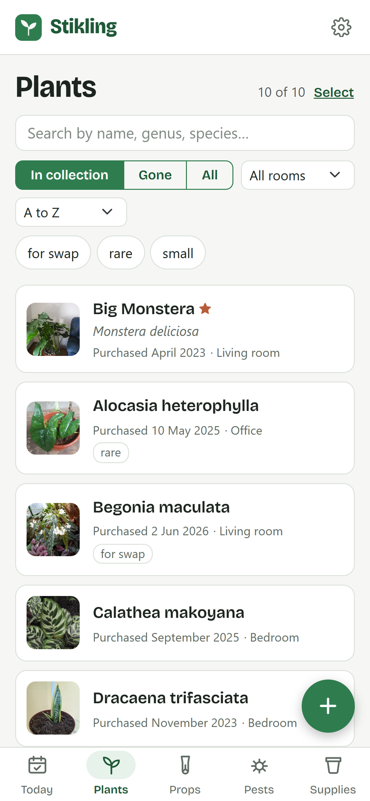
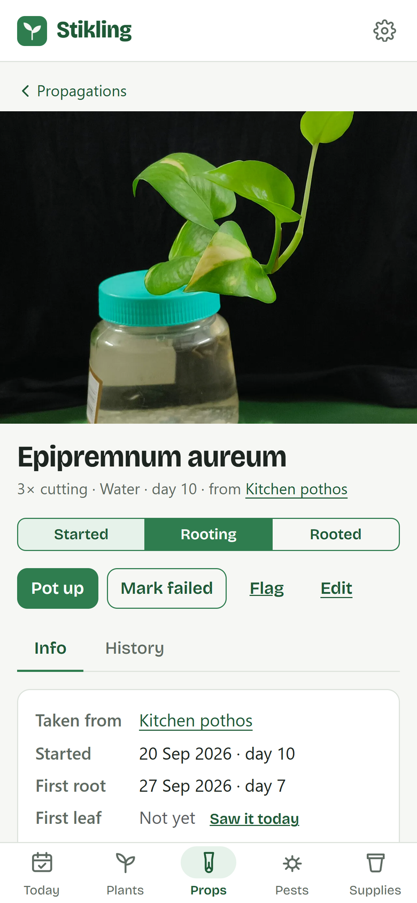
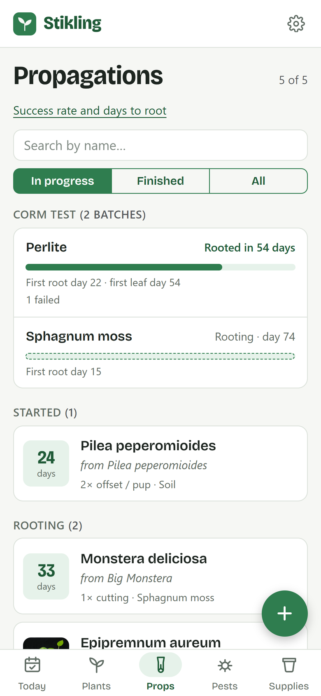

<p align="center">
  
</p>

<h1 align="center">Stikling</h1>

<p align="center">
  <b>Track your plants and every cutting they give you.</b><br>
  <a href="https://stikling.app">stikling.app</a>
</p>

*Stikling* is Danish for "cutting". It's a free app for houseplant people: keep track of your plants, the cuttings, corms and offsets you take from them, and how they all get on, with a photo history for each one.

Open [stikling.app](https://stikling.app) on your phone and start adding plants. It works offline and without an account, and you can add it to your home screen like any other app.

<p align="center">
  <picture>
    <source media="(prefers-color-scheme: dark)" srcset="docs/screenshots/plants-dark.png">
    
  </picture>
  <picture>
    <source media="(prefers-color-scheme: dark)" srcset="docs/screenshots/cutting-dark.png">
    
  </picture>
  <picture>
    <source media="(prefers-color-scheme: dark)" srcset="docs/screenshots/props-dark.png">
    
  </picture>
</p>

## What it does

- **Plants**: names, rooms, where you got them, tags, and a history of notes and photos.
- **Propagations**: cuttings, corms, offsets, seeds, divisions and air layers, each linked to the plant it came from, with what it's rooting in, how far along it is and how many you started. When one has rooted, pot it up as a new plant and the family tree stays.
- **Experiments**: start batches side by side in different mediums and see which one roots best and fastest.
- **Today**: what needs doing, like a propagation you haven't looked at in a while, a pest treatment that's due, or a plant you flagged.
- **Care, pests and supplies**: log watering and feeding, follow a pest problem and its treatments, and keep track of your pots, soil mixes and fertilisers. All of it is optional. A plant with just a name is fine.

Everything that's built, and what's planned next, is in the [feature list](docs/FEATURES.md).

## Your data

Everything is stored on your own device, so the app works offline and without an account. If you sign in, your plants, photos and settings are kept the same on all your devices. You can also export everything, photos included, as a ZIP file whenever you like.

The [privacy policy](https://stikling.app/privacy) says what is kept on the server when you sign in, and how to delete it.

Stikling is free, with no ads.

## About

I built Stikling to keep track of my own plants and the cuttings I take from them. It's a hobby project by [LaugeM](https://github.com/LaugeM), and the code is open source under the [AGPL-3.0 license](LICENSE).

Found a bug, or have a question or an idea? [Open an issue](https://github.com/LaugeM/stikling/issues). To help with the code, [CONTRIBUTING.md](CONTRIBUTING.md) says how.

## Development

### Tech stack

- C# / .NET 10, **Blazor WebAssembly** (standalone, PWA)
- Bootstrap 5
- Mediabunny (MPL-2.0), and h264-mp4-encoder (MIT, with libmp4v2 under MPL 1.1 inside it), to make the time-lapse video. They are only loaded when someone makes one, and their licences are in `src/Stikling.Web/wwwroot/lib`
- IndexedDB for on-device storage (via a small JS interop module)
- xUnit for the domain logic
- The sync API: ASP.NET Core minimal API with EF Core on SQL Server, photos in Azure Blob Storage, sign-in through Clerk, run locally with Docker Compose
- The app on GitHub Pages, the API on Azure Container Apps with Azure SQL, described in Bicep and deployed with GitHub Actions

The app runs entirely in the browser, so it can work offline and keep data on the device without a backend. It is hosted for free as static files, and the sync API is only used by people who sign in. The Razor components can later be reused in a .NET MAUI Blazor Hybrid app if a native Android/iOS version makes sense.

### Project structure

```
src/Stikling.Core/          Models and domain rules (no browser dependencies, unit tested)
src/Stikling.Web/           Blazor WebAssembly PWA
src/Stikling.Api/           The sync API for accounts, records and photos
tests/Stikling.Core.Tests/  xUnit tests for Core
tests/Stikling.Api.Tests/   xUnit tests for the API, against SQL Server and Azurite in Docker
tools/plant-names/          Builds the plant names the app suggests while you type
infra/                     The Azure resources for the hosted API, in Bicep
.github/                   Build/test/deploy workflow and GitHub Pages prep script
```

### Running locally

Requires the [.NET 10 SDK](https://dotnet.microsoft.com/download).

```bash
dotnet run --project src/Stikling.Web
```

[CONTRIBUTING.md](CONTRIBUTING.md) has how to run the tests and the sync API, how the code is laid out, and what to check before opening a pull request.

### Deployment

Every push to `main` runs the tests, deploys the app to GitHub Pages and the API to Azure. In the repo settings under Pages, the source needs to be set to GitHub Actions, and the custom domain to stikling.app.

[`prepare-pages.py`](.github/scripts/prepare-pages.py) sets the `<base href>`, updates the service worker's hash for `index.html`, and adds a `404.html` copy so deep links work. It also writes the pages search engines and AI tools read without running the app: `help.html` and `privacy.html`, which [`tools/static-pages/render.cs`](tools/static-pages/render.cs) renders from the app's own pages, `deletion.html`, and `llms.txt`.

[docs/ops/hosting.md](docs/ops/hosting.md) has how the API is hosted and how to set it up again. [docs/ops/data-requests.md](docs/ops/data-requests.md) has what to do when someone asks for a copy of their data.
